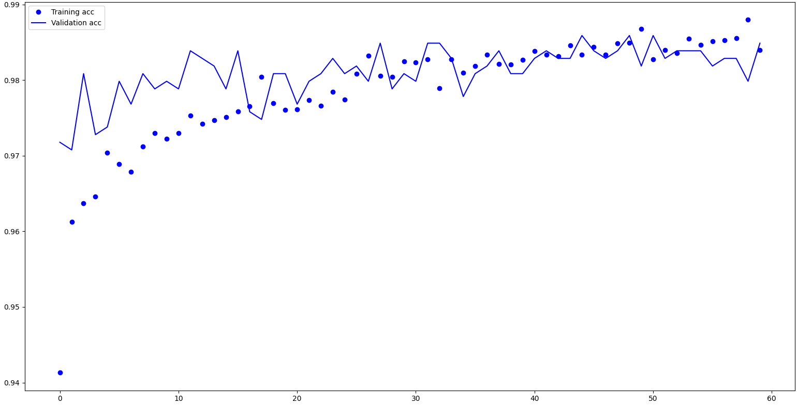
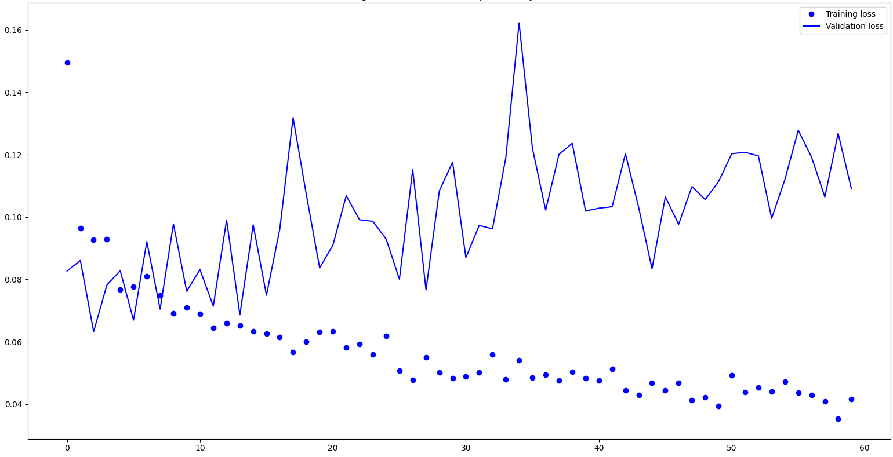
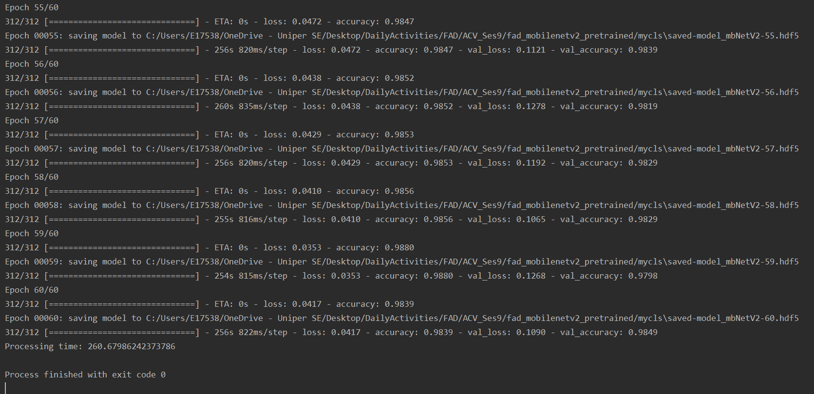

# mobilenetv2: customizing convolutional nets with pre-trained models

## Objectives

Use a mobilenetv2 model, freezing its layers, and adding layers at the end of network. The resulted network has 157
layers. Training this network to build a classifier for cats and dogs. Altogether 10000 training images have been used.
Another 2000 images are taken as validation.
Using pre-trained models increasingly improve accuracy of the network.

## Process

1. Load MobileNetV2 model.
2. Freeze all its 154 layers.
3. All a global_average_pooling2d layer.
4. Add two dense layers. Note that the number of neurons on the last layer must be the same as the number of classes
in the classifier.
5. Train the model and save each epoch with callbacks.

## Results

Accuracy of the trained model at each epoch.

Loss of the trained model at each epoch.

Showing the result of the last runs:

